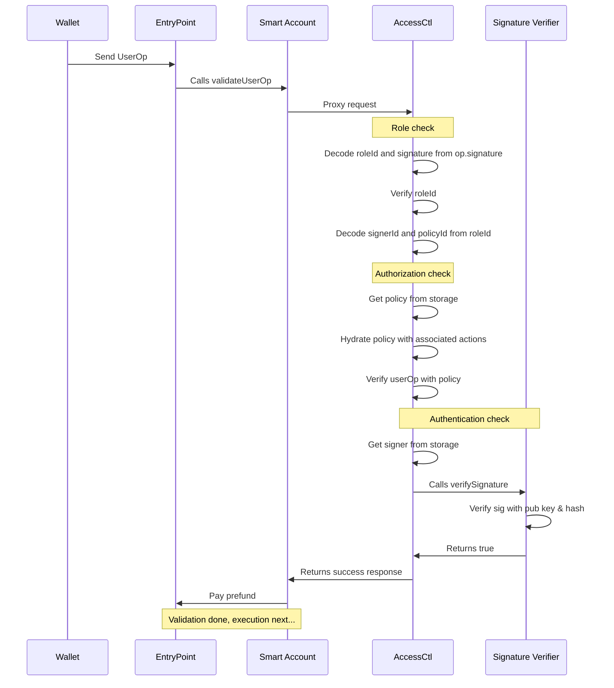
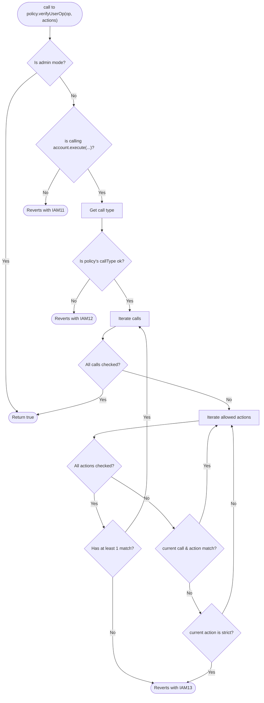

# AccessControl

> **⚠️ This module is still in early development. It is not yet recommended for production.**

AccessControl (or `AccessCtl` for short) is a scalable identity and access management layer for ERC-7579 compliant smart accounts.

## Module addresses

AccessCtl is deployed using the [deterministic deployment proxy](https://github.com/Arachnid/deterministic-deployment-proxy) and has the same address on all chains.

| Version | Address                                      | Commit                                                                                               | Audit |
| ------- | -------------------------------------------- | ---------------------------------------------------------------------------------------------------- | ----- |
| `0.1.0` | `0x73CE9574fDc085ad96106619Cf2f4e0366675450` | [d892c7c](https://github.com/stackup-wallet/accessctl/tree/d892c7c5e1c63e723aefc3946a83cbe817969e2b) | N/A   |

# Architecture

This project refers to an ERC-7579 validator and hook module that can be installed on any compliant smart account to enable advanced IAM features. The module is built with the following design goals in mind to support onchain organizations at every scale:

- **Authentication**: support for adding many `WebAuthn` and `ECDSA` signers to an account.
- **Authorization**: support for attaching transaction policies to each signer.
- **Gas optimized**: can scale for a large number of active signers and policies.
- **Easily auditable**: allows verifiable changelogs for tracking every validation update.

The remaining documentation will assume knowledge on ERC-4337 (Account Abstraction) and ERC-7579 (Minimal Modular Smart Accounts). If you are unfamiliar, we recommend the following resources to get started:

- [erc4337.io](https://www.erc4337.io/docs)
- [erc7579.com](https://erc7579.com/)

## End to end transaction flow

The following is a sequence diagram to illustrate the end to end flow of a `UserOperation`.



From the diagram, there are three variables that must be known to the wallet.

1. `roleId`: Concatenation of `signerId` + `policyId`.
2. `signerId`: An ID assigned by the module for every signer added.
3. `policyId`: An ID assigned by the module for every policy added.
4. `actionId`: An ID assigned by the module for every action added.

### Role check

The `roleId` is a `uint224` value that is encoded into the `UserOperation` signature field along with the `r` and `s` values of the signed `userOpHash`.

```solidity
userOp.signature = abi.encode(roleId, r, s);
```

During role check the AccessCtl module uses this `roleId` to verify with the state if the role is active. In other words, the module checks if a signer is allowed to assume a particular policy. If it is not active, validation will fail. Otherwise it continues with the authorization check.

The `roleId` is also unpacked into a `signerId` and `policyId` for authentication and authorization checks.

### Authorization check

In this phase the module checks that the `UserOperation` is valid for the assumed policy. Using the `policyId` it fetches the policy data from storage and cross checks it against the `userOperation`.

```solidity
bool valid = policy.verifyUserOp(userOp);
```

If the userOp passes the policy check it then moves on to the final phase.

### Authentication check

This last phase is to ensure that the signature from `userOp.signature` was actually signed by the relevant private key. The `signerId` is used to fetch the corresponding public key from storage and validate it with either a `WebAuthn` or `ECDSA` verifier.

```solidity
bool valid =  WebAuthn.verify(challenge, true, auth, signer.p256x, signer.p256y);

// Or if using ECDSA
signer.ecdsa == ECDSA.recover(ECDSA.toEthSignedMessageHash(hash), _getECDSASignature(signature));
```

If the signature is valid, it returns a success response and proceeds to the execution phase of a `UserOperation`.

## `AccessCtl` interface

The `AccessCtl` module inherits from the base ERC7579 validator and hook module. The following interface relates only to the `AccessCtl` contract.

### Signer functions

These functions relate to Authentication. The `signerId` is emitted via events and should be tracked on the application layer. For details, see definitions in [AccessCtl.sol](src/AccessCtl.sol) and [Signer.sol](src/Signer.sol).

```solidity
event SignerAdded(address indexed account, uint112 indexed signerId, Signer signer);
event SignerRemoved(address indexed account, uint112 indexed signerId);

function getSigner(address account, uint112 signerId) public view returns (Signer memory);
function addWebAuthnSigner(uint256 x, uint256 y) external;
function addECDSASigner(address member) external;
function removeSigner(uint112 signerId) external;
```

### Policy functions

These functions relate to Authorization. The `policyId` is emitted via events and should be tracked on the application layer. For details, see definitions in [AccessCtl.sol](src/AccessCtl.sol) and [Policy.sol](src/Policy.sol).

```solidity
event PolicyAdded(address indexed account, uint112 indexed policyId, Policy policy);
event PolicyRemoved(address indexed account, uint112 indexed policyId);

function getPolicy(address account, uint112 policyId) public view returns (Policy memory);
function addPolicy(Policy calldata p) external;
function removePolicy(uint112 policyId) external;
```

### Action functions

These functions also relate to Authorization. Every `Policy` can have up to 8 actions which are rules for evaluating an outgoing `CALL` from the smart account. The `actionId` is emitted via events and should be tracked by the application layer. For details, see definitions in [AccessCtl.sol](src/AccessCtl.sol) and [Action.sol](src/Action.sol).

```solidity
event ActionAdded(address indexed account, uint24 indexed actionId, Action action);
event ActionRemoved(address indexed account, uint24 indexed actionId);

function getAction(address account, uint24 actionId) public view returns (Action memory);
function addAction(Action calldata a) external;
function removeAction(uint24 actionId) external;
```

### Role functions

These functions relate to the association between signer and policy. The `roleId` is emitted via events and should be tracked on the application layer. For details, see definitions in [AccessCtl.sol](src/AccessCtl.sol).

```solidity
event RoleAdded(address indexed account, uint224 indexed roleId);
event RoleRemoved(address indexed account, uint224 indexed roleId);

function hasRole(address account, uint224 roleId) public view returns (bool);
function addRole(uint112 signerId, uint112 policyId) external;
function removeRole(uint224 roleId) external;
```

## Error codes

The `AccessCtl` module has the following error codes:

- `IAM1x`: Validate `UserOperation` errors.
- `IAM2x`: Validate ERC1271 signature errors.
- `IAM3x`: Configuration errors.

## Signers, Policies, and Actions

The following is a flow chart of how `AccessCtl` decides if a `UserOperation` is allowed based on a given `Signer`, `Policy`, and its associated `Actions`.



### `Signer` data structure

This data structure stores information on how to authenticate a `UserOperation`.

```solidity
struct Signer {
    uint256 p256x;
    uint256 p256y;
    address ecdsa;
    bytes1 mode;
}
```

#### Mode

This field determines which method to verify a signature with.

- `MODE_WEBAUTHN`: uses `p256x` and `p256y` to verify a signature using the WebAuthn standard.
- `MODE_ECDSA`: uses `ecdsa` to verify a signature using the [ERC-191](https://eips.ethereum.org/EIPS/eip-191) standard.

#### `p256x` and `p256y`

These are the `x` and `y` coordinates of a `secp256r1` public key used for WebAuthn verification.

#### `ecdsa` address

This is the related address that is used to check against the result of an `ecrecover` for ECDSA verification.

### `Policy` data structure

This data structure stores information on how to authorize a `UserOperation`.

```solidity
struct Policy {
    uint48 validAfter;
    uint48 validUntil;
    address erc1271Caller;
    bytes1 mode;
    bytes1 callTypeLevel;
    uint48 minimumInterval;
    uint192 allowActions;
}
```

#### Time range

A policy can be valid for a specific time range using a combination of the `validAfter` and `validUntil` fields.

- `validAfter`: The unix timestamp in seconds for when this policy will activate.
- `validUntil`: The unix timestamp in seconds for when this policy will expire.

> _Note that the [validation rules](https://eips.ethereum.org/EIPS/eip-7562) for account abstraction does not permit the use of the `TIMESTAMP` opcode during `validateUserOp`. If the rest of the policy is ok, these two values will be returned in the `validationData` and enforced by the `EntryPoint`._

#### Mode

This field allows encoding flags for common authorization modes. All flag values are defined in [Policy.sol](src/Policy.sol).

- `MODE_ADMIN`: Allows any `UserOperation` to be executed. This policy is already initialized during install with a `policyId` of `0`.
- `MODE_ERC1271_ADMIN`: Allows ERC1271 signature verification from any caller.

#### ERC1271

A policy can encode an address in the `erc1271Caller` field to allow a signer to validate signatures from a specific origin.

#### Call types

The `callTypeLevel` field allows authorization of call types. All flag values are defined in [Policy.sol](src/Policy.sol).

- `CALL_TYPE_LEVEL_SINGLE`: Only one external call is allowed per `UserOperation`.
- `CALL_TYPE_LEVEL_BATCH`: Allows batching of multiple external calls per `UserOperation`.

Note that other call types defined in the ERC-7579 spec such as `staticcall` and `delegatecall` are automatically denied outside `MODE_ADMIN`.

#### Rate limits

A policy can impose rate limits on a `UserOperation` via the `minimumInterval` field. This is a unix timestamp to specify how long a signer must wait between consecutive `UserOperations`.

#### Allow actions

The `allowActions` field links the policy with up to 8 call actions. This is done by packing a max of 8 `uint24` `actionIds` into a single `uint192` value. During authorization, each external call will be cross checked with each action. If the call matches none of the actions, then validation will fail.

### `Action` data structure

This data structure stores information on what type of external calls are allowed in a `UserOperation`.

```solidity
struct Action {
    bytes1 level;
    address target;
    bytes4 selector;
    uint16 argOffset;
    uint16 argLength;
    bytes1 argOperator;
    bytes1 payableOperator;
    bytes1 unused;
    bytes32 argValue;
    uint256 payableValue;
}
```

#### Level of strictness

The `level` field allows us to specify how strict this action is. All flag values are defined in [Action.sol](src/Action.sol).

- `LEVEL_ALLOW_FAIL`: By default an action can fail. If the call matches another action in the policy then the `UserOperation` is still authorized to proceed.
- `LEVEL_MUST_PASS_FOR_TARGET`: If the call matches the target then this action must pass or the entire `UserOperation` is unauthorized to proceed.
- `LEVEL_MUST_PASS`: This action must pass for every call in the `UserOperation`. If one call fails regardless of the target, then the entire `UserOperation` is unauthorized to proceed.

This allows us to build more secure policies by ensure a call matches multiple actions. For example, we can create two actions for an ERC20 transfer where one validates the address argument and the other validates the value argument. Both must pass for the top level policy to be validated.

#### Allowed targets

An external call can be authorized for a single address only using the `target` field. Encoding an `address(0)` here will allow all targets.

#### Allowed selectors

We can narrow down to specific functions on an external call using the `selector` field. For example to allow only calls to `transfer(address,uint256)`, the 4 byte selector would be set to `0xa9059cbb`. A zero value here will allow all functions.

#### Argument validation

The following fields allow us to validate specific arguments in a call.

- `argOffset`: Where in the call data to being the slice.
- `argLength`: How many bytes after the `argOffset` to end the slice.
- `argOperator`: The conditional operator to use for the check (e.g. `<`, `>`, `==`, etc).
- `argValue`: The reference value to compare the sliced call data value with.

> _Note that we compare all arguments against a 32 byte `argValue` with left padding for smaller types. For instance an `argValue` for an address will be 20 bytes + 12 zero bytes added to the left._

#### Payable validation

The following fields allow us to validate the amount of ETH (or native tokens) sent during a call.

- `payableOperator`: The conditional operator to use for the check (e.g. `<`, `>`, `==`, etc).
- `payableValue`: The reference value to compare the call value with.

## Configuration logic

> _Note that this module MUST be explicitly installed as a `TYPE_VALIDATOR` and `TYPE_HOOK` to be considered as initialized. The following refers to installation of the validator. Installation of the hook is effectively a noop from the perspective of the module._

On install, the `AccessCtl` does the following steps:

1. Adds the root signer passed in via call data. It assigns the `signerId` of `0`.
2. Adds an admin policy (i.e. a blank `Policy` with `mode` set to `MODE_ADMIN`). It assigns the `policyId` of `0`.
3. Adds a null action to `actionId` `0`.
4. Attaches the admin policy to the root signer. It assigns the association a `roleId` of `0`.

These steps are idempotent and will cause a revert if `onInstall` is called again on an initialized account.

On uninstall, the `AccessCtl` will effectively wipe all existing signers and policies from the account's state. It will also reset `signerId` and `policyId` back to `0`.

# Contributing

This project requires [Foundry](https://book.getfoundry.sh/) and builds on top of [ModuleKit](https://docs.rhinestone.wtf/modulekit). If you're developing with VSCode, we also recommend using the [Solidity extension by Nomic Foundation](https://github.com/NomicFoundation/hardhat-vscode).

## Install dependencies

Install `node_modules`:

```shell
pnpm install
```

Install foundry submodules:

```shell
forge install
```

## Building modules

All smart contracts live under the [src](./src/) directory.

```shell
forge build
```

## Testing modules

All tests live under the [test](./test/) directory.

```shell
forge test
```

## Deploying the module

1. Import your modules into the `script/DeployModule.s.sol` file.
2. Create a `.env` file in the root directory based on the `.env.example` file and fill in the variables.
3. Run the following command:

```shell
source .env && forge script script/DeployModule.s.sol:DeployModuleScript --rpc-url $DEPLOYMENT_RPC --broadcast --sender $DEPLOYMENT_SENDER --verify
```

Your module is now deployed to the blockchain and verified on Etherscan.

If the verification fails, you can manually verify it on Etherscan using the following command:

```shell
source .env && forge verify-contract --chain-id [YOUR_CHAIN_ID] --watch --etherscan-api-key $ETHERSCAN_API_KEY [YOUR_MODULE_ADDRESS] src/[PATH_TO_MODULE].sol:[MODULE_CONTRACT_NAME]
```

# License

Distributed under the GPL-3.0 License. See [LICENSE](./LICENSE) for more information.
