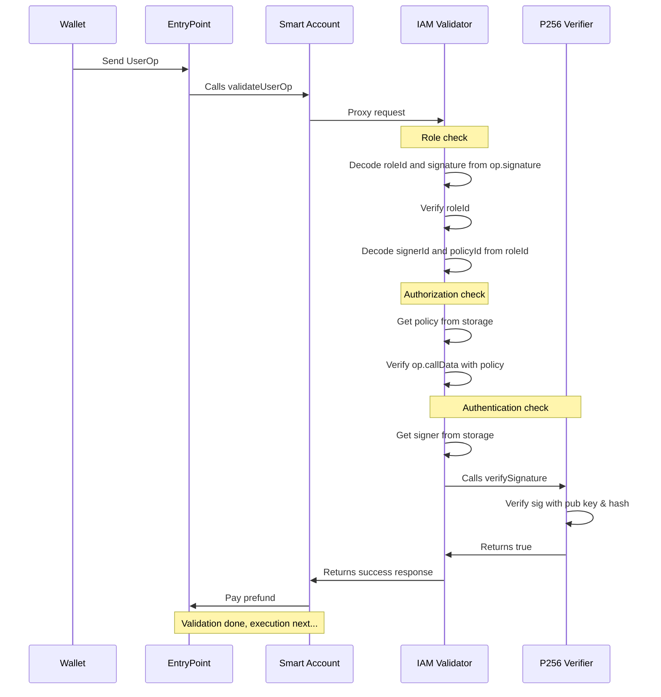

# ERC-7579 IAM Module

A scalable identity and access management layer for ERC-4337 modular smart accounts.

# Architecture

This project refers to an ERC-7579 validator module that can be installed on any compliant smart account to enable advanced IAM features. The module is built with the following design goals in mind to support onchain organizations at every scale:

- **Authentication**: support for adding many `secp256r1` signers to an account.
- **Authorization**: support for attaching transaction policies to each signer.
- **Gas optimized**: can scale for a large number of active signers and policies.
- **Easily auditable**: allows verifiable changelogs for tracking every validation update.

The remaining documentation will assume knowledge on ERC-4337 (Account Abstraction) and ERC-7579 (Minimal Modular Smart Accounts). If you are unfamiliar, we recommend the following resources to get started:

- [erc4337.io](https://www.erc4337.io/docs)
- [erc7579.com](https://erc7579.com/)

## End to end transaction flow

The following is a sequence diagram to illustrate the end to end flow of a `UserOperation`.



From the diagram, there are three variables that must be known to the wallet.

1. `roleId`: Concatenation of `signerId` + `policyId`.
2. `signerId`: An ID assigned by the module for every signer added.
3. `policyId`: An ID assigned by the module for every policy added.

### Role check

The `roleId` is a `uint240` value that is encoded into the `UserOperation` signature field along with the `r` and `s` values of the signed `userOpHash`.

```solidity
userOp.signature = abi.encode(roleId, r, s);
```

During role check the IAM validator uses this `roleId` to verify with the state if the role is active. In other words, the module checks if a signer is allowed to assume a particular policy. If it is not active, validation will fail. Otherwise it continues with the authorization check.

The `roleId` is also unpacked into a `signerId` and `policyId` for authentication and authorization checks.

### Authorization check

In this phase the module checks that the `UserOperation` is valid for the assumed policy. Using the `policyId` we fetch the policy data from storage and cross check it against the `userOperation`.

```solidity
bool valid = policy.verifyUserOp(userOp);
```

If the userOp passes the policy check it then moves on to the final phase.

### Authentication check

This last phase is to ensure that the signature from `userOp.signature` was actually signed by the relevant private key. The `signerId` is used to fetch the corresponding `x` and `y` coordinate of the public key from storage and validate it with a `P256` verifier.

```solidity
bool valid = P256.verifySignature(userOpHash, r, s, x, y);
```

If the signature is valid, it returns a success response and proceeds to the execution phase of a `UserOperation`.

## `IAMValidator` interface

The `IAMValidator` inherits from the base ERC7579 validator module. The following interface relates only to the `IAMValidator`.

### Signer functions

These functions relate to Authentication. The `signerId` is emitted via events and should be tracked on the application layer. For details, see definitions in [IAMValidator.sol](src/IAMValidator.sol) and [Signer.sol](src/Signer.sol).

```solidity
event SignerAdded(address indexed account, uint120 indexed signerId, uint256 x, uint256 y);
event SignerRemoved(address indexed account, uint120 indexed signerId);

function getSigner(address account, uint120 signerId) public view returns (Signer memory);
function addSigner(uint256 x, uint256 y) external;
function removeSigner(uint120 signerId) external;
```

### Policy functions

These functions relate to Authorization. The `policyId` is emitted via events and should be tracked on the application layer. For details, see definitions in [IAMValidator.sol](src/IAMValidator.sol) and [Policy.sol](src/Policy.sol).

```solidity
event PolicyAdded(address indexed account, uint120 indexed policyId, Policy p);
event PolicyRemoved(address indexed account, uint120 indexed policyId);

function getPolicy(address account, uint120 policyId) public view returns (Policy memory);
function addPolicy(Policy calldata p) external;
function removePolicy(uint120 policyId) external;
```

### Role functions

These functions relate to the association between signer and policy. The `roleId` is emitted via events and should be tracked on the application layer. For details, see definitions in [IAMValidator.sol](src/IAMValidator.sol).

```solidity
event RoleAdded(address indexed account, uint240 indexed roleId);
event RoleRemoved(address indexed account, uint240 indexed roleId);

function hasRole(address account, uint240 roleId) public view returns (bool);
function addRole(uint120 signerId, uint120 policyId) external;
function removeRole(uint240 roleId) external;
```

## Error codes

The `IAMValidator` has the following error codes:

- `IAM1x`: Validate `UserOperation` errors.
- `IAM2x`: Validate ERC1271 signature errors.

## Encoding a `Policy`

```
TBD
```

# Contributing

This project requires [Foundry](https://book.getfoundry.sh/) and builds on top of [ModuleKit](https://docs.rhinestone.wtf/modulekit). If you're developing with VSCode, we also recommend using the [Solidity extension by Nomic Foundation](https://github.com/NomicFoundation/hardhat-vscode).

## Install dependencies

Install `node_modules`:

```shell
pnpm install
```

Install foundry submodules:

```shell
forge install
```

## Building modules

All smart contracts live under the [src](./src/) directory.

```shell
forge build
```

## Testing modules

All tests live under the [test](./test/) directory.

```shell
forge test
```

## Deploying the module

1. Import your modules into the `script/DeployModule.s.sol` file.
2. Create a `.env` file in the root directory based on the `.env.example` file and fill in the variables.
3. Run the following command:

```shell
source .env && forge script script/DeployModule.s.sol:DeployModuleScript --rpc-url $DEPLOYMENT_RPC --broadcast --sender $DEPLOYMENT_SENDER --verify
```

Your module is now deployed to the blockchain and verified on Etherscan.

If the verification fails, you can manually verify it on Etherscan using the following command:

```shell
source .env && forge verify-contract --chain-id [YOUR_CHAIN_ID] --watch --etherscan-api-key $ETHERSCAN_API_KEY [YOUR_MODULE_ADDRESS] src/[PATH_TO_MODULE].sol:[MODULE_CONTRACT_NAME]
```

# License

Distributed under the GPL-3.0 License. See [LICENSE](./LICENSE) for more information.
