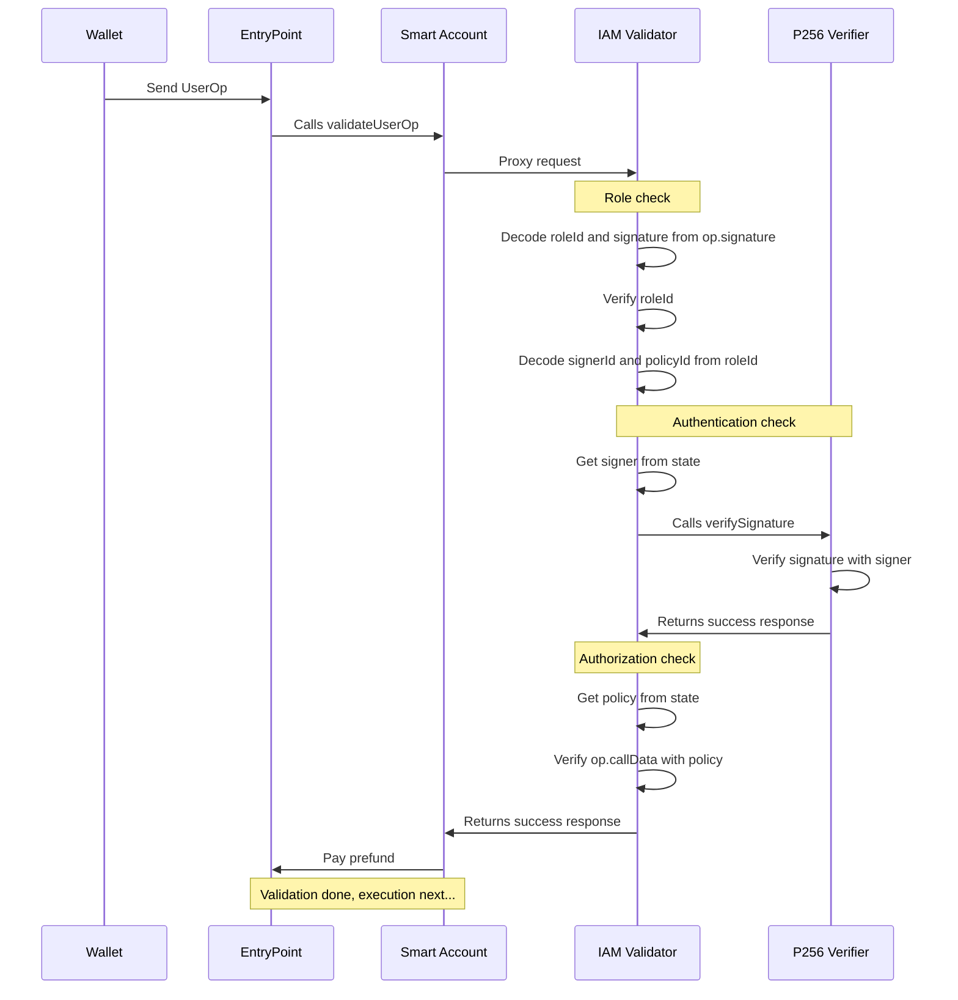

# ERC-7579 IAM Module

A scalable identity and access management layer for ERC-4337 modular smart accounts.

# Architecture

This project refers to an ERC-7579 validator module that can be installed on any compliant smart account to enable advanced IAM features. The module is built with the following design goals in mind to support onchain organizations at every scale:

- **Authentication**: support for adding many `secp256r1` signers to an account.
- **Authorization**: support for attaching transaction policies to each signer.
- **Gas optimized**: can scale for a large number of active signers and policies.
- **Easily auditable**: allows verifiable changelogs for tracking every validation update.

The remaining documentation will assume knowledge on ERC-4337 (Account Abstraction) and ERC-7579 (Minimal Modular Smart Accounts). If you are unfamiliar, we recommend the following resources to get started:

- [erc4337.io](https://www.erc4337.io/docs)
- [erc7579.com](https://erc7579.com/)

## End to end transaction flow

The following is a sequence diagram to illustrate the end to end flow of a UserOperation.



From the diagram, there are three variables that must be known to the wallet.

1. `roleId`: Concatenation of `signerId` + `policyId`.
2. `signerId`: An ID assigned by the module for every signer added.
3. `policyId`: An ID assigned by the module for every policy added.

### Role check

The `roleId` is a `uint240` value that is encoded into the `UserOperation` signature field along with the `r` and `s` values of the signed `userOpHash`.

```solidity
userOp.signature = abi.encode(roleId, r, s);
```

During role check the IAM validator uses this `roleId` to verify within the state if its active or not. In other words, it allows the module to check if a signer is allowed to assume a particular policy. If it is not active, validation will fail. Otherwise it continues with the authentication check.

### Authentication check

Next the IAM validator verifies that the signature from `userOp.signature` was actually signed by the relevant private key. To do this the the `roleId` is decoded into two `uint120` values for `signerId` and `policyId`.

The `signerId` is then used to fetch the corresponding `x` and `y` coordinate of the public key with the state. We then have everything needed for authentication.

```solidity
bool valid = P256.verifySignature(userOpHash, r, s, x, y);
```

### Authorization check

```
TBD
```

## `IAMValidator` interface

```
TBD
```

# Contributing

This project requires [Foundry](https://book.getfoundry.sh/) and builds on top of [ModuleKit](https://docs.rhinestone.wtf/modulekit). If you're developing with VSCode, we also recommend using the [Solidity extension by Nomic Foundation](https://github.com/NomicFoundation/hardhat-vscode).

## Install dependencies

Install `node_modules`:

```shell
pnpm install
```

Install foundry submodules:

```shell
forge install
```

## Building modules

All smart contracts live under the [src](./src/) directory.

```shell
forge build
```

## Testing modules

All tests live under the [test](./test/) directory.

```shell
forge test
```

## Deploying modules

1. Import your modules into the `script/DeployModule.s.sol` file.
2. Create a `.env` file in the root directory based on the `.env.example` file and fill in the variables.
3. Run the following command:

```shell
source .env && forge script script/DeployModule.s.sol:DeployModuleScript --rpc-url $DEPLOYMENT_RPC --broadcast --sender $DEPLOYMENT_SENDER --verify
```

Your module is now deployed to the blockchain and verified on Etherscan.

If the verification fails, you can manually verify it on Etherscan using the following command:

```shell
source .env && forge verify-contract --chain-id [YOUR_CHAIN_ID] --watch --etherscan-api-key $ETHERSCAN_API_KEY [YOUR_MODULE_ADDRESS] src/[PATH_TO_MODULE].sol:[MODULE_CONTRACT_NAME]
```

# License

Distributed under the GPL-3.0 License. See [LICENSE](./LICENSE) for more information.
