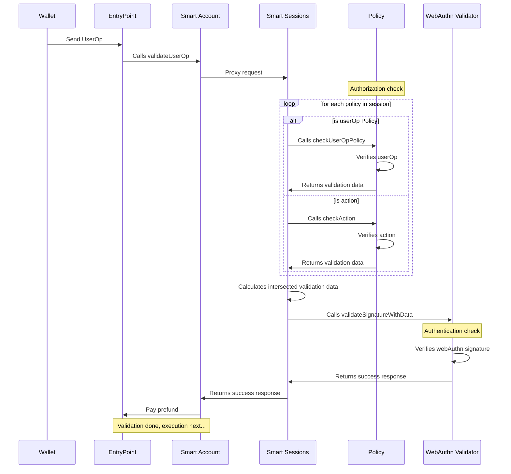

# AccessControl

> **⚠️ This module is still in early development. It is not yet recommended for production.**

AccessControl (or `AccessCtl` for short) builds of the [Smart Sessions module](https://github.com/erc7579/smartsessions) to enable attribute-based access control (ABAC) for ERC-7579 smart accounts.

## Module status

AccessCtl is deployed using the [deterministic deployment proxy](https://github.com/Arachnid/deterministic-deployment-proxy) and has the same address on all chains.

### `v0.1.x` (WIP)

| Contracts                                                                                                                                                                   | Address                                      | Commit                                                                                                   | Audit |
| --------------------------------------------------------------------------------------------------------------------------------------------------------------------------- | -------------------------------------------- | -------------------------------------------------------------------------------------------------------- | ----- |
| [`SmartSession.sol`](https://github.com/stackup-wallet/smartsessions/blob/7040bc591731190a11e5793112c5fb09c5b1c6b0/contracts/SmartSession.sol)                              | `0x6bE56eDd1C49dE9dAd31E27877d8948E5F0a2Bc2` | [7040bc5](https://github.com/stackup-wallet/smartsessions/tree/7040bc591731190a11e5793112c5fb09c5b1c6b0) | N/A   |
| [`SudoPolicy.sol`](https://github.com/erc7579/smartsessions/blob/b1624f851f56ec67cc677dce129e9caa12fcafd9/contracts/external/policies/SudoPolicy.sol)                       | `0xbA37a0Dc3f059cDAdEF5cc97F92191d14AC9ee39` | [b1624f8](https://github.com/erc7579/smartsessions/tree/b1624f851f56ec67cc677dce129e9caa12fcafd9)        | N/A   |
| [`WebAuthnValidator.sol`](https://github.com/stackup-wallet/accessctl/blob/c83029d4bacc6dd8a4d7133f58a278d9b12e374e/src/signers/WebAuthnValidator.sol)                      | `0xcB6D0D07f8304db1bfa06D75bD4F9a9F559b312e` | [c83029d](https://github.com/stackup-wallet/accessctl/tree/c83029d4bacc6dd8a4d7133f58a278d9b12e374e)     | N/A   |
| [`IntervalSpendingLimitPolicy.sol`](https://github.com/stackup-wallet/accessctl/blob/c83029d4bacc6dd8a4d7133f58a278d9b12e374e/src/policies/IntervalSpendingLimitPolicy.sol) | `0xa9C63723e9070B5d2a534fE3D25e2e403F09860A` | [c83029d](https://github.com/stackup-wallet/accessctl/tree/c83029d4bacc6dd8a4d7133f58a278d9b12e374e)     | N/A   |

#### Compatibility status

A "✅" means that AccessCtl has been end to end tested with the following Smart Account versions and confirmed compatible.

| Kernel `v3.1` | Safe7579 `v1.0.2` | Nexus |
| ------------- | ----------------- | ----- |
| ✅            | ❌                | ❌    |

# Architecture

This project refers to a collection of signer and policy contracts to extend the ERC-7579 Smart Sessions module. The extensions are built with the following design goals in mind to support onchain organizations at every scale:

- **Authentication**: support for adding users (or bots) under an ABAC model.
- **Authorization**: support for adding custom attributes to each user.
- **Gas optimized**: can scale for a large number of active users and attributes.
- **Easily auditable**: allows verifiable changelogs for tracking every access control update.

The remaining documentation will assume knowledge on ERC-4337 (Account Abstraction), ERC-7579 (Minimal Modular Smart Accounts), and Smart Sessions. If you are unfamiliar, we recommend the following resources to get started:

- [erc4337.io](https://www.erc4337.io/docs)
- [erc7579.com](https://erc7579.com/)
- [Smart Sessions](https://github.com/erc7579/smartsessions)

## End to end transaction flow

The following is a sequence diagram to illustrate the end to end flow of a `UserOperation`.



### `WebAuthnValidator.sol`

The [WebAuthnValidator.sol](./src/signers/WebAuthnValidator.sol) is a minimal wrapper around [webauthn-sol](https://github.com/base-org/webauthn-sol) to enable compatibility with the required smart session interface. This allows sessions to be authenticated directly with an end user's passkey.

### `IntervalSpendingLimitPolicy.sol`

the [IntervalSpendingLimitPolicy](./src/policies/IntervalSpendingLimitPolicy.sol) is fork of [SpendingLimitPolicy.sol](https://github.com/erc7579/smartsessions/blob/main/contracts/external/policies/SpendingLimitPolicy.sol). The difference is the inclusion of added logic to reset the accrued spend after a defined interval.

> **Note that this policy relies on the `TIMESTAMP` opcode during validation which is not compliant with the canonical mempool. This is required to ensure time intervals work as expected.**

# Contributing

This project requires [Foundry](https://book.getfoundry.sh/) to be installed. If you're developing with VSCode, we also recommend using the [Solidity extension by Nomic Foundation](https://github.com/NomicFoundation/hardhat-vscode).

## Install dependencies

Install `node_modules`:

```shell
pnpm install
```

Install foundry submodules:

```shell
forge install
```

## Building modules

All smart contracts live under the [src](./src/) directory.

```shell
forge build
```

## Testing modules

All tests live under the [test](./test/) directory.

```shell
forge test
```

## Deploying the module

1. Import your modules into the `script/DeployModule.s.sol` file.
2. Create a `.env` file in the root directory based on the `.env.example` file and fill in the variables.
3. Run the following command:

```shell
source .env && forge script script/DeployModule.s.sol:DeployModuleScript --rpc-url $DEPLOYMENT_RPC --broadcast --sender $DEPLOYMENT_SENDER --verify
```

Your module is now deployed to the blockchain and verified on Etherscan.

If the verification fails, you can manually verify it on Etherscan using the following command:

```shell
source .env && forge verify-contract --chain-id [YOUR_CHAIN_ID] --watch --etherscan-api-key $ETHERSCAN_API_KEY [YOUR_MODULE_ADDRESS] src/[PATH_TO_MODULE].sol:[MODULE_CONTRACT_NAME]
```

# License

Distributed under the GPL-3.0 License. See [LICENSE](./LICENSE) for more information.
